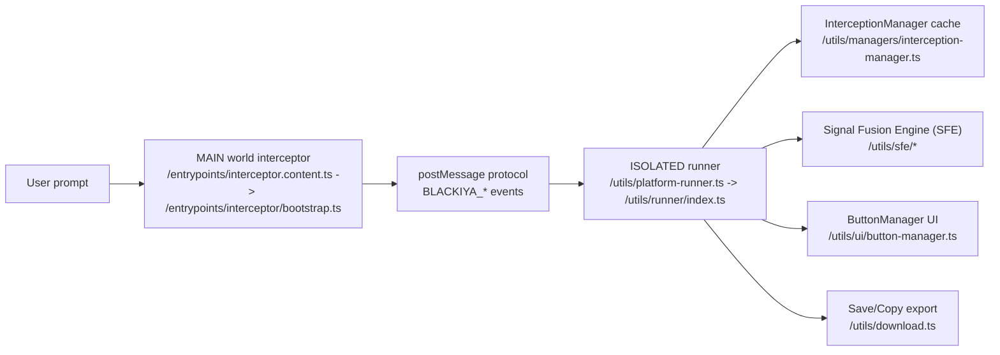
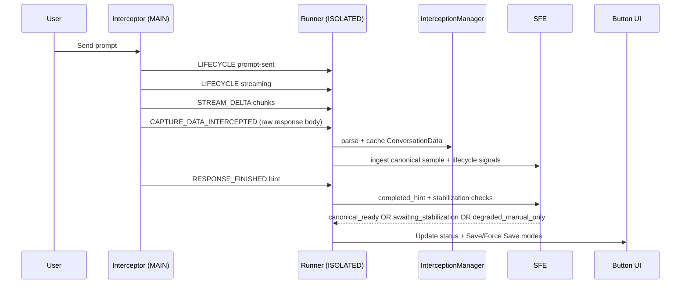

# Blackiya Architecture

> Scope: ChatGPT, Gemini, Grok capture pipeline (streaming + final JSON export)

## 1) System Overview

Blackiya is a Manifest V3 browser extension that:
1. Detects when an LLM response is in progress.
2. Detects when it is complete.
3. Captures canonical conversation JSON.
4. Enables export only when readiness rules pass.

The architecture is split across two runtime worlds:
- MAIN world interceptor (hooks page `fetch`/`XMLHttpRequest`).
- ISOLATED world runner (state machine, readiness gating, UI, export).

## 2) Core Runtime Components

- Entry point:
  - `entrypoints/main.content.ts`
- Interceptor (MAIN world):
  - `entrypoints/interceptor.content.ts`
  - `entrypoints/interceptor/bootstrap.ts`
  - `entrypoints/interceptor/attempt-registry.ts`
  - `entrypoints/interceptor/fetch-pipeline.ts`
  - `entrypoints/interceptor/xhr-pipeline.ts`
  - `entrypoints/interceptor/snapshot-bridge.ts`
  - `entrypoints/interceptor/state.ts`
  - `entrypoints/interceptor/signal-emitter.ts`
  - `entrypoints/interceptor/discovery.ts`
- Platform orchestrator:
  - `utils/platform-runner.ts`
  - `utils/runner/index.ts`
  - `utils/runner/*` (state/lifecycle/export/probe/calibration/bridge + attempt/readiness modules)
  - `utils/runner/attempt-registry.ts` (attempt-id resolution: `resolveRunnerAttemptId` for writes, `peekRunnerAttemptId` for reads)
  - `utils/runner/calibration-policy.ts` (calibration ordering + persistence policy helpers)
  - `utils/runner/canonical-stabilization.ts` (canonical stabilization retry state helpers)
  - `utils/runner/readiness.ts`
  - `utils/runner/stream-preview.ts` (pending/live stream preview merge and snapshot preservation)
- Calibration profile management:
  - `utils/calibration-profile.ts` (strategy defaults, `CalibrationStep` type, `buildCalibrationProfileFromStep` manual-strict policy)
  - `utils/runner/calibration-runner.ts` (step prioritization, re-exports `CalibrationStep`)
- Adapter interface + readiness contract:
  - `platforms/types.ts`
- Adapter factory:
  - `platforms/factory.ts`
- SFE types + transitions:
  - `utils/sfe/types.ts`
  - `utils/sfe/signal-fusion-engine.ts`
  - `utils/sfe/probe-lease-protocol.ts`
  - `utils/sfe/probe-lease-coordinator.ts`
  - `utils/sfe/probe-lease-store.ts`
  - `utils/sfe/cross-tab-probe-lease.ts`
- Background lease coordinator:
  - `entrypoints/background.ts`
- Protocol message definitions:
  - `utils/protocol/messages.ts`

## 3) Wire Protocol (MAIN -> ISOLATED)

Primary events:
- `BLACKIYA_RESPONSE_LIFECYCLE` (`prompt-sent`, `streaming`, `completed`, `terminated`)
- `BLACKIYA_STREAM_DELTA` (live text/thinking fragments)
- `BLACKIYA_RESPONSE_FINISHED` (completion hint)
- `BLACKIYA_CONVERSATION_ID_RESOLVED` (late ID resolution)
- `BLACKIYA_TITLE_RESOLVED` (stream-derived title)
- `LLM_CAPTURE_DATA_INTERCEPTED` (raw canonical payload)
- `BLACKIYA_STREAM_DUMP_FRAME` (optional diagnostics stream dump)
- `attemptId` is mandatory for lifecycle/finished/delta wire messages (legacy attempt-less compatibility removed in v2.0.2)

See:
- `utils/protocol/messages.ts`

## 4) Lifecycle and Readiness Model

UI lifecycle (`platform-runner`): `idle -> prompt-sent -> streaming -> completed`

SFE lifecycle (`utils/sfe/types.ts`):
- `idle`
- `prompt_sent`
- `streaming`
- `completed_hint`
- `canonical_probing`
- `captured_ready`
- `terminated_partial`
- `error`
- `superseded`
- `disposed`

Readiness decision modes:
- `canonical_ready` (Save enabled)
- `awaiting_stabilization` (Save disabled)
- `degraded_manual_only` (Force Save only)

Critical invariant:
- Completion hint alone never guarantees export readiness.
- Completion hints are advisory and must pass canonical-readiness gating before Save is enabled.
- Network completion debounce is attempt-aware: same-conversation new attempts use a shorter debounce window than repeated same-attempt hints.
- Generic/placeholder late title signals must never overwrite an already-resolved specific conversation title.
- Lifecycle must be monotonic for the same attempt/conversation context (`completed` must not regress to `streaming` or `prompt-sent`).
- Cross-world message ingress is token-validated for both live `postMessage` traffic and late-start queue drains (`__BLACKIYA_CAPTURE_QUEUE__`, `__BLACKIYA_LOG_QUEUE__`).
- Snapshot/getJSON bridge requests and responses are token-stamped and token-validated symmetrically.
- Session bootstrap token initialization is first-in-wins (`BLACKIYA_SESSION_INIT` accepts only the first valid token for the page session).
- **Attempt-ID read/write separation:** `peekAttemptId` (read-only, no side effects) is used for logging, display, throttle key generation, and readiness checks. `resolveAttemptId` (mutating, creates/updates active attempt) is reserved for write paths: response-finished, stream-done probe, force-save recovery, visibility recovery, SFE ingestion.
- **Calibration profile policy:** Two tiers exist: (a) generic strategy defaults (`buildDefaultCalibrationProfile`) with standard timings, and (b) manual-strict policy (`buildCalibrationProfileFromStep`) with tighter domQuietWindow (800ms vs 1200ms for conservative/snapshot) and always-disabled `['dom_hint', 'snapshot_fallback']`. `CalibrationStep` mapping is now reversible via a distinct `snapshot` strategy for `page-snapshot`. The runner exclusively uses the manual-strict policy path.
- **Retention hygiene:** pending lifecycle cache is explicitly bounded with near-cap warning telemetry, and SFE resolution cache prunes stale terminal entries plus enforces a max-resolution bound.

## 5) End-to-End Flow (Generic)

## 6) Platform Flows

### 6.1 ChatGPT

Key endpoints/signals:
- Prompt stream: `/backend-api/f/conversation` (SSE)
- Completion hint endpoint: `/backend-api/conversation/{id}/stream_status`
- Canonical fetch: `/backend-api/conversation/{id}`

Flow:
1. Interceptor detects POST to `/backend-api/f/conversation`.
2. Monitors SSE frames token-by-token (`monitorChatGptSseLifecycle`).
3. Emits lifecycle and deltas while streaming.
4. Emits `TITLE_RESOLVED` from `title_generation` frames.
5. Emits completion hint after stream done.
6. Runner stabilizes canonical sample and enables Save when ready.

Primary code:
- `entrypoints/interceptor/bootstrap.ts`
- `platforms/chatgpt.ts`

### 6.2 Gemini

Key endpoints/signals:
- Generation endpoint: `/_/BardChatUi/data/assistant.lamda.BardFrontendService/StreamGenerate`
- Metadata/title endpoint (non-generation): batchexecute `rpcids=MaZiqc`
- Conversation payload endpoint (metadata and conversation mixes): batchexecute variants

Flow:
1. Interceptor classifies generation endpoints via:
   - `utils/gemini-request-classifier.ts`
2. For StreamGenerate, monitor fetch/XHR progress and parse incremental buffer via:
   - `utils/gemini-stream-parser.ts`
3. Emit stream deltas, conversation-id resolved, and title candidates from stream metadata.
4. XHR `loadend` completion is one-shot per attempt state to avoid duplicate `completed` lifecycle emission.
5. Parse intercepted payloads into canonical `ConversationData`.
6. Runner waits for canonical readiness before Save.

Title strategy:
1. Stream-derived title (`BLACKIYA_TITLE_RESOLVED`) if available.
2. Adapter-cached title from RPC parsing.
3. DOM fallback at export time (`extractTitleFromDom`) if cached title is generic/stale:
   - includes placeholders like `You said ...`
   - checks heading and active sidebar conversation title nodes

Primary code:
- `platforms/gemini.ts`
- `utils/gemini-stream-parser.ts`

State management:
- Mutable Gemini adapter state (title cache + active conversation cache) is encapsulated in `GeminiAdapterState`.
- `resetGeminiAdapterState()` is exported for deterministic test isolation.

### 6.3 Grok

Surfaces:
- `grok.com` REST/NDJSON
- `x.com` Grok endpoint variants

Generation and completion classification:
- `utils/grok-request-classifier.ts`
  - Generation lifecycle: `/rest/app-chat/conversations/new`, `/2/grok/add_response.json`
  - Completion candidates: `response-node`, `load-responses`
  - Explicitly excluded from completion hints: `/conversations/new`, `reconnect-response-v2`

Streaming parser:
- `utils/grok-stream-parser.ts`
  - Extracts text candidates
  - Extracts reasoning/thinking candidates (`deepsearch_headers`, `thinking_trace`)
  - Handles partial NDJSON buffers across chunks

Flow:
1. Interceptor observes Grok generation request.
2. Emits `prompt-sent` and `streaming` only for generation endpoints.
3. Parses NDJSON chunks and emits live stream deltas.
4. Captures canonical payloads from response-node/load-responses.
5. Emits completion hints only when parsed Grok payload is terminal-ready.
6. Runner stabilizes and enables Save.

Title strategy:
1. `conversations_v2`/history-derived titles.
2. DOM fallback on save for placeholder titles like `New conversation`.

Primary code:
- `platforms/grok.ts`
- `utils/grok-stream-parser.ts`
- `utils/grok-request-classifier.ts`

State management:
- All mutable state (conversation titles LRU, active conversations LRU, last-active conversation ID) is encapsulated in `GrokAdapterState` class.
- `resetGrokAdapterState()` is exported for test isolation and deterministic cleanup.

## 7) How Idle -> Streaming -> Completed Is Determined

Source of truth priority:
1. Interceptor lifecycle signals (platform-classified request flow)
2. Completion hints (endpoint-classified and readiness-guarded)
3. Canonical readiness checks in runner/SFE
4. Fallback stabilization probes

The runner applies lifecycle updates only for active attempt/conversation bindings and drops stale/superseded signals.
For the same attempt/conversation, regressive lifecycle transitions are rejected (`completed` remains terminal).
When lifecycle signals arrive before conversation ID resolution (common for Gemini XHR and Grok `/conversations/new`), the runner caches them as pending by attempt and replays once `BLACKIYA_CONVERSATION_ID_RESOLVED` is received. **The UI badge is updated immediately** for pending `prompt-sent` and `streaming` signals — callers see the lifecycle phase even before the conversation ID resolves.
For Grok specifically, the original lifecycle attempt may be disposed by SPA navigation before the conversation ID resolves. When canonical capture data arrives on a new attempt with ready data, `shouldPromoteGrokFromCanonicalCapture` promotes the lifecycle to `completed` — this promotion accepts `idle`, `prompt-sent`, and `streaming` states.
When Grok SPA navigates from a null conversation ID to the new conversation URL (e.g., `/` → `/c/<id>`), the runner **preserves the active lifecycle state** (`prompt-sent`/`streaming`) via `isLifecycleActiveGeneration()` guard. This guard protects three code paths that would otherwise reset lifecycle to `idle`:
1. `handleConversationSwitch` — skips `setLifecycleState('idle')` and `buttonManager.remove()` when transitioning from null → new conversation during active generation.
2. `resetButtonStateForNoConversation` — called by `refreshButtonState`/health-check when conversation ID is null; now skips the idle reset during active generation.
3. `injectSaveButton` no-conversation path — called during initial load retries; now skips the idle reset during active generation.
Additionally, `handleConversationSwitch` skips `disposeInFlightAttemptsOnNavigation` during null→new-conversation active generation to prevent the interceptor stream monitor from exiting early, ensuring streaming data continues to flow.
Cross-conversation navigation (from one existing conversation to another) continues to reset lifecycle to `idle` and dispose attempts as expected.
On route changes, in-flight attempts bound to the destination conversation are preserved; unrelated in-flight attempts are disposed.
Completion hints can move lifecycle state, but Save remains blocked until canonical readiness resolves to `canonical_ready`.

Key methods:
- `utils/runner/index.ts`:
  - `handleLifecycleMessage`
  - `handleResponseFinishedMessage`
  - `resolveReadinessDecision`
  - `refreshButtonState`
  - `runStreamDoneProbe`

## 8) How Final JSON Is Built

Save pipeline:
1. `handleSaveClick` checks readiness (`canonical_ready` or explicit degraded force-save path).
2. `getConversationData` fetches cached canonical conversation.
3. Applies title fallback resolution if title is generic.
4. Builds export payload:
   - Original conversation JSON, or
   - Common-export format (`buildCommonExport`) if selected.
5. Attaches `__blackiya.exportMeta`:
   - `captureSource`
   - `fidelity`
   - `completeness`
6. Downloads JSON via `downloadAsJSON`.

Primary code:
- `utils/runner/index.ts`
- `utils/common-export.ts`
- `utils/download.ts`

### 8.1 Title Consistency and Stickiness

Title precedence (highest to lowest):
1. Stream/API title signals (`BLACKIYA_TITLE_RESOLVED`, adapter-cached RPC titles).
2. Cached specific-title preservation in interception cache (`InterceptionManager` remembers specific titles per conversation).
3. Adapter DOM fallback only when the cached title is generic/placeholder.
4. Export-time fallback (first-user-message derivation) as the final safety net.

Invariant:
- Generic late titles must not clobber specific resolved titles already seen for the same conversation.
- Snapshot refresh ingestion preserves cache object identity when possible, so delayed adapter title updates (for example Gemini title RPCs that arrive after stream-done snapshot fallback) still apply to the cached conversation.

### 8.2 Cross-Tab Probe Lease Arbitration

Lease model (v2.0.3):
1. Runner always attempts cross-tab probe lease arbitration before stream-done canonical probe.
2. Lease client (`utils/sfe/cross-tab-probe-lease.ts`) sends runtime messages:
   - `BLACKIYA_PROBE_LEASE_CLAIM`
   - `BLACKIYA_PROBE_LEASE_RELEASE`
3. Background service worker owns arbitration via `ProbeLeaseCoordinator` and persists lease records in `chrome.storage.session` (with in-memory fallback if session storage is unavailable).
4. Claims are owner-exclusive until expiry; release is owner-only and idempotent.
5. If runtime transport is unavailable, lease client fails open so capture does not stall.

Invariants:
- Lease arbitration is always-on (no user setting gate).
- Non-owner release cannot clear an active lease.
- Expired leases are pruned and can be deterministically taken over.
- Coordinator hydration is single-flight (concurrent claims share one hydration pass), and failed hydration attempts are retried on subsequent operations.

## 9) Diagnostics and Debugging

Debug artifacts:
- Debug report (token-lean): `utils/minimal-logs.ts`
- Full logs JSON: persistent logs storage
- Optional stream dump:
  - captures `delta`, `heuristic`, `snapshot`, `lifecycle` frames by attempt
- Readiness debug logs:
  - canonical-ready decisions are TTL-deduped per conversation to avoid health-check log floods

Docs:
- `docs/debug-logs-guide.md`
- `docs/discovery-mode.md`

## 10) Current Gaps / Ongoing Verification

- ✅ Grok lifecycle regression fixed: pending signals now update UI badge immediately; canonical capture promotes from idle.
- ✅ Attempt-ID read/write separation completed (H-01): read-only paths no longer mutate `activeAttemptId`.
- ✅ Calibration builder centralized (H-02): no more duplicated profile construction between `calibration-profile.ts` and `runner/index.ts`.
- ✅ Runner decomposition continuation completed (H-03): calibration policy, canonical stabilization, and stream preview helper clusters extracted into dedicated runner modules.
- ✅ Interceptor decomposition continuation completed (H-04): attempt binding/lookup/disposal logic extracted to `entrypoints/interceptor/attempt-registry.ts`; bootstrap now consumes injected registry methods.
- ✅ Grok adapter state isolated (H-05): all mutable state encapsulated in `GrokAdapterState` class; `resetGrokAdapterState()` available for test isolation.
- Need continued multi-tab validation for Grok and Gemini under long reasoning sessions.
- Keep regression suite expanding where smoke tests find platform-specific edge cases.
- Remaining post-v2.0.6 backlog: P2 items (logging/type-hygiene/perf follow-ups) and P4 defense-in-depth hardening.
- P4 defense-in-depth: token validation for InterceptionManager, snapshot response path, queue stamping, JSON bridge restoration, SESSION_INIT first-in-wins lock.
