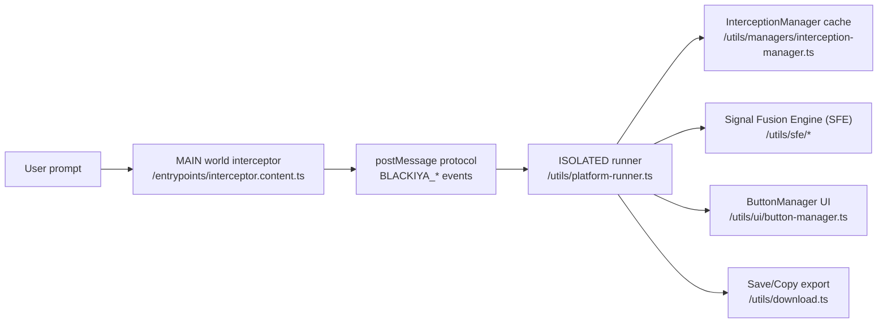
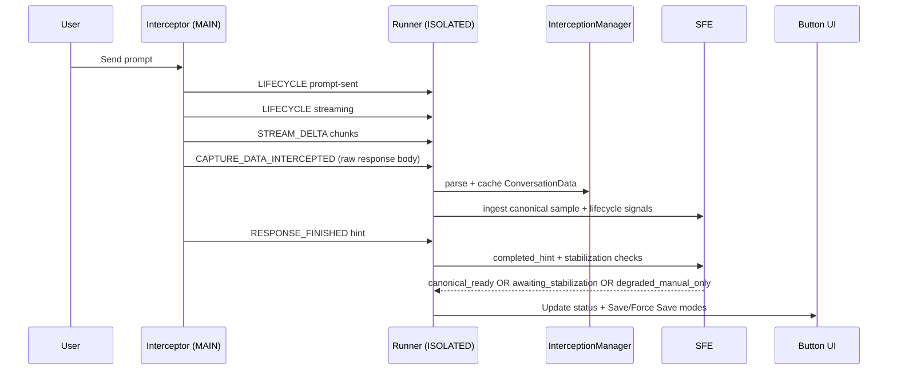

# Blackiya Architecture

> Last updated: 2026-02-17 (PR finalization docs pass)
> Scope: ChatGPT, Gemini, Grok capture pipeline (streaming + final JSON export)

## 1) System Overview

Blackiya is a Manifest V3 browser extension that:
1. Detects when an LLM response is in progress.
2. Detects when it is complete.
3. Captures canonical conversation JSON.
4. Enables export only when readiness rules pass.

The architecture is split across two runtime worlds:
- MAIN world interceptor (hooks page `fetch`/`XMLHttpRequest`).
- ISOLATED world runner (state machine, readiness gating, UI, export).

## 2) Core Runtime Components

- Entry point:
  - `entrypoints/main.content.ts`
- Interceptor (MAIN world):
  - `entrypoints/interceptor.content.ts`
- Platform orchestrator:
  - `utils/platform-runner.ts`
- Adapter interface + readiness contract:
  - `platforms/types.ts`
- Adapter factory:
  - `platforms/factory.ts`
- SFE types + transitions:
  - `utils/sfe/types.ts`
  - `utils/sfe/signal-fusion-engine.ts`
- Protocol message definitions:
  - `utils/protocol/messages.ts`

## 3) Wire Protocol (MAIN -> ISOLATED)

Primary events:
- `BLACKIYA_RESPONSE_LIFECYCLE` (`prompt-sent`, `streaming`, `completed`, `terminated`)
- `BLACKIYA_STREAM_DELTA` (live text/thinking fragments)
- `BLACKIYA_RESPONSE_FINISHED` (completion hint)
- `BLACKIYA_CONVERSATION_ID_RESOLVED` (late ID resolution)
- `BLACKIYA_TITLE_RESOLVED` (stream-derived title)
- `LLM_CAPTURE_DATA_INTERCEPTED` (raw canonical payload)
- `BLACKIYA_STREAM_DUMP_FRAME` (optional diagnostics stream dump)

See:
- `utils/protocol/messages.ts`

## 4) Lifecycle and Readiness Model

UI lifecycle (`platform-runner`): `idle -> prompt-sent -> streaming -> completed`

SFE lifecycle (`utils/sfe/types.ts`):
- `idle`
- `prompt_sent`
- `streaming`
- `completed_hint`
- `canonical_probing`
- `captured_ready`
- `terminated_partial`
- `error`
- `superseded`
- `disposed`

Readiness decision modes:
- `canonical_ready` (Save enabled)
- `awaiting_stabilization` (Save disabled)
- `degraded_manual_only` (Force Save only)

Critical invariant:
- Completion hint alone never guarantees export readiness.
- Completion hints are advisory and must pass canonical-readiness gating before Save is enabled.
- Generic/placeholder late title signals must never overwrite an already-resolved specific conversation title.

## 5) End-to-End Flow (Generic)

## 6) Platform Flows

### 6.1 ChatGPT

Key endpoints/signals:
- Prompt stream: `/backend-api/f/conversation` (SSE)
- Completion hint endpoint: `/backend-api/conversation/{id}/stream_status`
- Canonical fetch: `/backend-api/conversation/{id}`

Flow:
1. Interceptor detects POST to `/backend-api/f/conversation`.
2. Monitors SSE frames token-by-token (`monitorChatGptSseLifecycle`).
3. Emits lifecycle and deltas while streaming.
4. Emits `TITLE_RESOLVED` from `title_generation` frames.
5. Emits completion hint after stream done.
6. Runner stabilizes canonical sample and enables Save when ready.

Primary code:
- `entrypoints/interceptor.content.ts`
- `platforms/chatgpt.ts`

### 6.2 Gemini

Key endpoints/signals:
- Generation endpoint: `/_/BardChatUi/data/assistant.lamda.BardFrontendService/StreamGenerate`
- Metadata/title endpoint (non-generation): batchexecute `rpcids=MaZiqc`
- Conversation payload endpoint (legacy/metadata mixes): batchexecute variants

Flow:
1. Interceptor classifies generation endpoints via:
   - `utils/gemini-request-classifier.ts`
2. For StreamGenerate, monitor fetch/XHR progress and parse incremental buffer via:
   - `utils/gemini-stream-parser.ts`
3. Emit stream deltas, conversation-id resolved, and title candidates from stream metadata.
4. Parse intercepted payloads into canonical `ConversationData`.
5. Runner waits for canonical readiness before Save.

Title strategy:
1. Stream-derived title (`BLACKIYA_TITLE_RESOLVED`) if available.
2. Adapter-cached title from RPC parsing.
3. DOM fallback at export time (`extractTitleFromDom`) if cached title is generic/stale:
   - includes placeholders like `You said ...`
   - checks heading and active sidebar conversation title nodes

Primary code:
- `platforms/gemini.ts`
- `utils/gemini-stream-parser.ts`

### 6.3 Grok

Surfaces:
- `grok.com` REST/NDJSON
- `x.com` Grok endpoint variants

Generation and completion classification:
- `utils/grok-request-classifier.ts`
  - Generation lifecycle: `/rest/app-chat/conversations/new`, `/2/grok/add_response.json`
  - Completion candidates: `response-node`, `load-responses`
  - Explicitly excluded from completion hints: `/conversations/new`, `reconnect-response-v2`

Streaming parser:
- `utils/grok-stream-parser.ts`
  - Extracts text candidates
  - Extracts reasoning/thinking candidates (`deepsearch_headers`, `thinking_trace`)
  - Handles partial NDJSON buffers across chunks

Flow:
1. Interceptor observes Grok generation request.
2. Emits `prompt-sent` and `streaming` only for generation endpoints.
3. Parses NDJSON chunks and emits live stream deltas.
4. Captures canonical payloads from response-node/load-responses.
5. Emits completion hints only when parsed Grok payload is terminal-ready.
6. Runner stabilizes and enables Save.

Title strategy:
1. `conversations_v2`/history-derived titles.
2. DOM fallback on save for placeholder titles like `New conversation`.

Primary code:
- `platforms/grok.ts`
- `utils/grok-stream-parser.ts`
- `utils/grok-request-classifier.ts`

## 7) How Idle -> Streaming -> Completed Is Determined

Source of truth priority:
1. Interceptor lifecycle signals (platform-classified request flow)
2. Completion hints (endpoint-classified and readiness-guarded)
3. Canonical readiness checks in runner/SFE
4. Fallback stabilization probes

The runner applies lifecycle updates only for active attempt/conversation bindings and drops stale/superseded signals.
On route changes, in-flight attempts bound to the destination conversation are preserved; unrelated in-flight attempts are disposed.
Completion hints can move lifecycle state, but Save remains blocked until canonical readiness resolves to `canonical_ready`.

Key methods:
- `utils/platform-runner.ts`:
  - `handleLifecycleMessage`
  - `handleResponseFinishedMessage`
  - `resolveReadinessDecision`
  - `refreshButtonState`
  - `runStreamDoneProbe`

## 8) How Final JSON Is Built

Save pipeline:
1. `handleSaveClick` checks readiness (`canonical_ready` or explicit degraded force-save path).
2. `getConversationData` fetches cached canonical conversation.
3. Applies title fallback resolution if title is generic.
4. Builds export payload:
   - Original conversation JSON, or
   - Common-export format (`buildCommonExport`) if selected.
5. Attaches `__blackiya.exportMeta`:
   - `captureSource`
   - `fidelity`
   - `completeness`
6. Downloads JSON via `downloadAsJSON`.

Primary code:
- `utils/platform-runner.ts`
- `utils/common-export.ts`
- `utils/download.ts`

### 8.1 Title Consistency and Stickiness

Title precedence (highest to lowest):
1. Stream/API title signals (`BLACKIYA_TITLE_RESOLVED`, adapter-cached RPC titles).
2. Cached specific-title preservation in interception cache (`InterceptionManager` remembers specific titles per conversation).
3. Adapter DOM fallback only when the cached title is generic/placeholder.
4. Export-time fallback (first-user-message derivation) as the final safety net.

Invariant:
- Generic late titles must not clobber specific resolved titles already seen for the same conversation.

## 9) Diagnostics and Debugging

Debug artifacts:
- Debug report (token-lean): `utils/minimal-logs.ts`
- Full logs JSON: persistent logs storage
- Optional stream dump:
  - captures `delta`, `heuristic`, `snapshot`, `lifecycle` frames by attempt
- Readiness debug logs:
  - canonical-ready decisions are TTL-deduped per conversation to avoid health-check log floods

Docs:
- `docs/debug-logs-guide.md`
- `docs/discovery-mode.md`

## 10) Current Gaps / Ongoing Verification

- Grok runtime smoke verification still ongoing after lifecycle gating fixes.
- Need continued multi-tab validation for Grok and Gemini under long reasoning sessions.
- Keep regression suite expanding where smoke tests find platform-specific edge cases.
